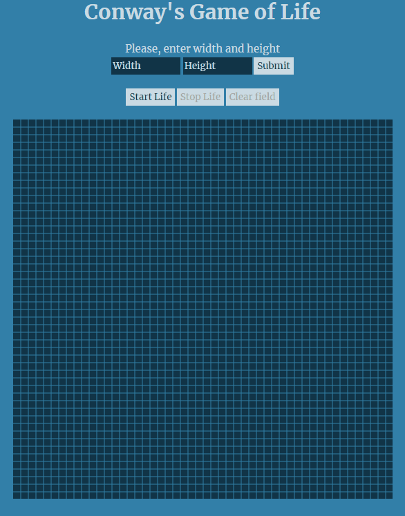

# Conway's Game of Life

Here is the legendary [Game of Life](https://en.wikipedia.org/wiki/Conway%27s_Game_of_Life), created by John Horton Conway. 

You can see a brief demo below. 
 
* To **start** the game, draw *cells* in the *field* and push `Start Life`.
* To **stop** (*pause*), push `Stop Life`. Then you can either continue generating *cells* by pushing `Start Life` or clear the *field* using `Clear field` button.
* You can also set a custom measures fore the *field*, using `inputs`.

The games's graphic is implemented using canvas with js.
You can enjoy it [here](https://thelastandrew.github.io/game-of-life/).
